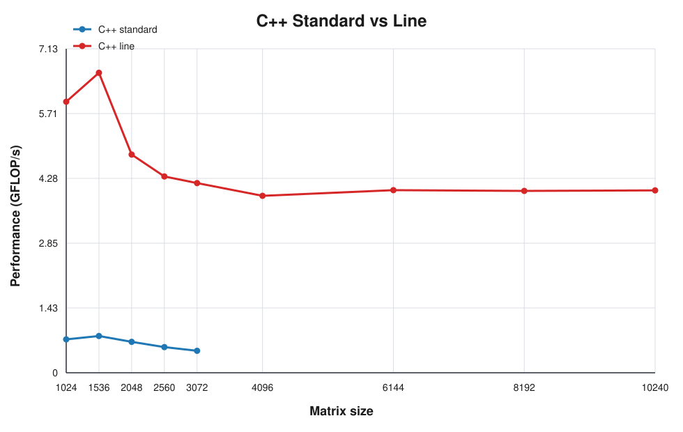
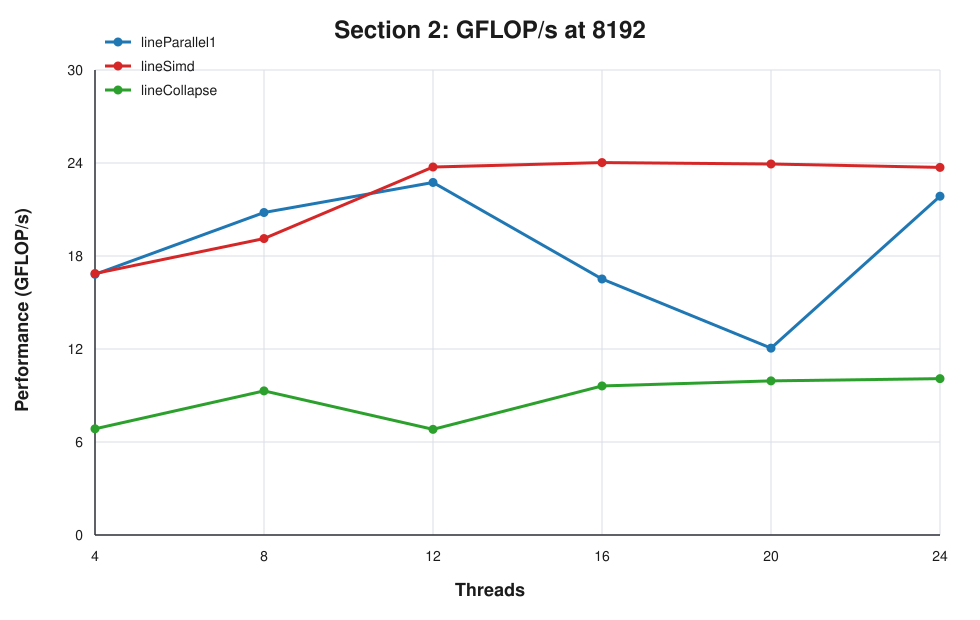

# Parallel and Distributed Computing Projects

Projects developed for the **Parallel and Distributed Computing (CPD)** course at FEUP. This repository explores performance-aware programming, shared-memory parallelism and distributed systems through two complementary assignments.

## Projects at a Glance

| Project | Focus | Technologies |
| --- | --- | --- |
| [Assignment 1 — Matrix Multiplication Performance](#assignment-1--matrix-multiplication-performance) | Cache locality, benchmarking, parallelism and vectorization | C++17, Java, OpenMP, SIMD, Linux `perf` |
| [Assignment 2 — Distributed Chat System](#assignment-2--distributed-chat-system) | Networking, concurrency, fault recovery and local AI integration | Java 21, TCP sockets, virtual threads, locks, Ollama |

## Assignment 1 — Matrix Multiplication Performance

A performance study of dense matrix multiplication, focused on how **memory-access patterns, cache locality and parallelization strategies** affect execution time and throughput.

The project implements and compares:

- classic `i-j-k` matrix multiplication in C++ and Java;
- cache-friendly `i-k-j` loop reordering;
- blocked/tiled multiplication for large matrices;
- OpenMP variants using different work-distribution strategies;
- SIMD-assisted execution with `#pragma omp simd`;
- a `collapse(2)` experiment with atomic updates.

Performance is evaluated through execution time, **GFLOP/s**, speedup and parallel efficiency. Hardware counters collected with Linux `perf`—including cache references, cache misses, cycles, instructions and IPC—connect the benchmark results to the underlying memory behaviour.

### Key findings

- Reordering the loops from `i-j-k` to `i-k-j` achieved roughly **7–8.6× higher throughput** in the shared C++ test range by improving spatial locality.
- Blocking provided a further improvement on large matrices by keeping smaller working sets in cache.
- Parallelizing independent output rows produced the most effective OpenMP decomposition tested.
- SIMD improved the strongest parallel variant, while fine-grained synchronization in the collapsed version limited scalability.





[Read the complete Assignment 1 report](assign1/README.md)

## Assignment 2 — Distributed Chat System

A multi-user **client-server chat system** built in Java over TCP. It combines a text protocol, persistent user accounts, resumable sessions and concurrent room management in a fault-aware architecture.

### Core capabilities

- user registration and authentication;
- expiring session tokens and session resumption;
- automatic reconnection after a broken TCP connection;
- creation, discovery and membership of multiple chat rooms;
- real-time room messaging and in-memory message history;
- Java virtual threads for connection handling and asynchronous work;
- explicit synchronization of shared state with `ReentrantLock`;
- per-client outgoing queues and dedicated writer threads;
- bounded-queue protection that disconnects persistently slow clients;
- optional AI rooms backed by a locally hosted Ollama model.

In an AI room, the server combines the room prompt with its conversation history, requests a response from Ollama through its local REST API and broadcasts the result to the connected members. Standard chat functionality remains available when Ollama is not running.

### Architecture

```text
┌────────────────┐          TCP           ┌─────────────────────────┐
│ Console Client │ ─────────────────────► │      Chat Server        │
│                │ ◄───────────────────── │                         │
│ reconnect and  │                        │ auth, sessions, rooms,  │
│ token resume   │                        │ routing and concurrency │
└────────────────┘                        └────────────┬────────────┘
                                                    │ Local REST API
                                                    ▼
                                           ┌─────────────────┐
                                           │     Ollama      │
                                           │ local AI model  │
                                           └─────────────────┘
```

Each accepted connection is handled independently with virtual threads. Shared collections are protected by locks, while socket output is decoupled through a bounded queue per client so one slow receiver cannot block message delivery to the rest of the system.

[Read the complete Assignment 2 documentation](assign2/README.md)

## Repository Structure

```text
.
├── assign1/
│   ├── src/             # C++, Java and OpenMP implementations
│   ├── results/         # Raw and consolidated benchmark data
│   ├── doc/figures/     # Performance visualizations
│   ├── Makefile
│   └── README.md
├── assign2/
│   ├── src/             # Client, protocol and server packages
│   ├── data/            # Persistent user records
│   ├── compile.sh
│   ├── server.sh
│   ├── client.sh
│   ├── clean.sh
│   └── README.md
└── README.md
```

## Authors

- Diogo Alves
- José Teixeira
- Tiago Ribeiro

This repository contains academic work developed as part of the CPD course at FEUP.
