# Part 1

## Introduction
The goal of Part 1 is to study how memory access patterns affect the performance of matrix multiplication on a single core. The assignment compares different loop orders and a blocked version of the algorithm, and then relates execution time and GFLOP/s to processor counters collected with `perf`.

All versions perform the same theoretical amount of work, `2n^3` floating-point operations for an `n x n` matrix multiplication, but they do not interact with memory in the same way, leading to different cache utilization patterns. As a result, two implementations with the same arithmetic complexity can have very different performance.

## What the assignment asks
The assignment requests three algorithmic variants:

1. **Version 1 (`standard`)**: the classic `i-j-k` matrix multiplication.
2. **Version 2 (`line`)**: the `i-k-j` reordering, which improves the access pattern to matrix `B` and to the result matrix `C`.
3. **Blocked version (`block`)**: a cache-aware C++ version that multiplies submatrices instead of traversing the full matrix in one pass.

The required measurements are:

- execution time and GFLOP/s for C++ and Java on `1024..3072` for `standard` and `line`
- execution time and GFLOP/s for C++ on `4096..10240` for `line`
- execution time and GFLOP/s for C++ on `4096..10240` for `block` with block sizes `128`, `256`, and `512`
- relevant `perf` counters to support the interpretation of cache and memory behavior

This matters because matrix multiplication is strongly affected by locality. A better traversal order reduces cache misses, improves reuse of cache lines, and keeps the CPU busy with useful work instead of waiting for data.

## Implementation Overview
The implementation is split across two source files:

- `src/mult.cpp`: C++ implementations of `standard`, `line`, and `block`
- `src/mult.java`: Java implementations of `standard` and `line`

Both programs:

- allocate three dense matrices `A`, `B`, and `C`
- initialize `A` with `1.0`
- initialize `B[i][j]` with `i + 1`
- measure execution time around the multiplication kernel
- compute performance as `GFLOP/s = 2n^3 / (time * 10^9)`


## Algorithms
### `standard` (`i-j-k`)
The standard version computes one output element at a time:

```text
for i
    for j
        temp = 0
        for k
            temp += A[i][k] * B[k][j]
        C[i][j] = temp
```

This is the classic multiplication, but it traverses matrix `B` column-wise. In row-major memory, that access pattern is unfriendly to cache and causes many misses as the matrices grow.

### `line` (`i-k-j`)
The line-oriented version changes the loop order:

```text
for i
    for k
        for j
            C[i][j] += A[i][k] * B[k][j]
```

This version reuses `A[i][k]` across a full row update of `C[i][j]` and accesses `B[k][j]` row-wise. That improves spatial locality and helps improve performance by a large ammount compared with `standard`.

### `block`
The blocked version divides the matrices into smaller tiles:

```text
for ii in blocks
    for kk in blocks
        for jj in blocks
            multiply block(ii, kk) with block(kk, jj)
```

The purpose is to keep smaller working sets inside cache for longer. The best block size depends on the effective cache hierarchy and on the interaction between cache capacity and traversal order, so different block sizes may win at different matrix sizes.

## Experimental Setup
The consolidated Part 1 dataset uses the following setup:

- C++ compiled with `-O2` (g++)
- Java compiled with `javac`
- execution pinned to a single core (using `taskset`)
- 3 runs per measured case
- `perf` counters collected data for C++

The measurement scope is:

| Variant | Language | Sizes |
| --- | --- | --- |
| `standard` | C++, Java | `1024 to 3072`, intervals `512` |
| `line` | C++, Java | `1024 to 3072` , intervals `512` |
| `line` | C++ | `4096 to 10240`, intervals `2048` |
| `block` | C++ | `4096 to 10240`, intervals `2048`, block sizes `128`, `256`, `512` |

The analyzed processor counters are the `cpu_core` events:

- `cache-references`
- `cache-misses`
- `cycles`
- `instructions`

The `cpu_atom` counters were recorded as well, but they show essentially zero running time in this dataset, so the conclusions below focus on `cpu_core`.

## Results and Analysis
### C++ vs Java, `standard`
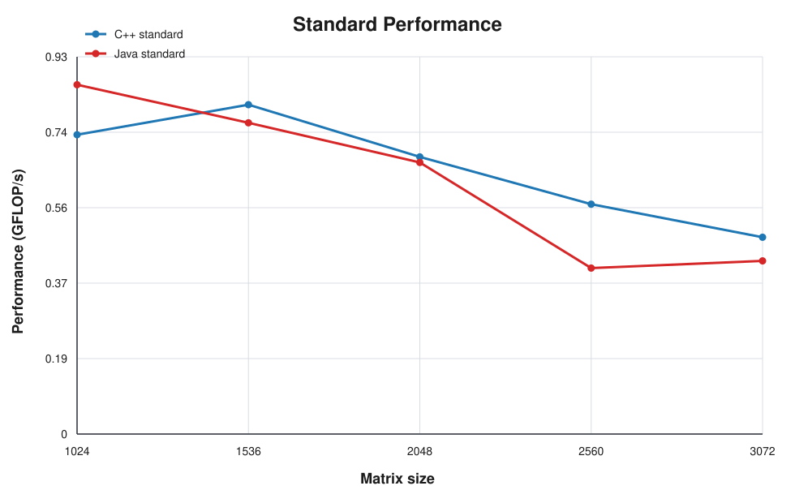

The `standard` algorithm performs poorly in both languages because the `i-j-k` traversal reads matrix `B` with poor locality. Both implementations remain below `1 GFLOP/s` throughout the tested range.

Java is slightly faster for some of the smaller sizes in this dataset, while C++ becomes faster in the larger cases. At `3072`, C++ reaches about `0.484 GFLOP/s` and Java about `0.426 GFLOP/s`, so the difference is present but still modest. This is consistent with an algorithm dominated by memory access inefficiency rather than by pure arithmetic throughput.

### C++ vs Java, `line`
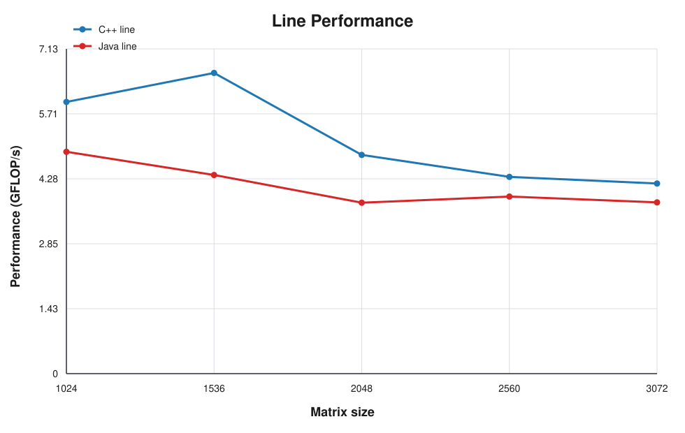

The `line` version is much faster than `standard` for both languages. C++ stays ahead across the whole shared range, from roughly `5.97 GFLOP/s` at `1024` to `4.18 GFLOP/s` at `3072`, while Java moves from about `4.87 GFLOP/s` to `3.76 GFLOP/s`.

The main reason is that `i-k-j` matches row-major storage much better. The performance gap between languages is present, but the dominant effect is the loop reordering itself rather than the language runtime.

### `standard` vs `line` in C++
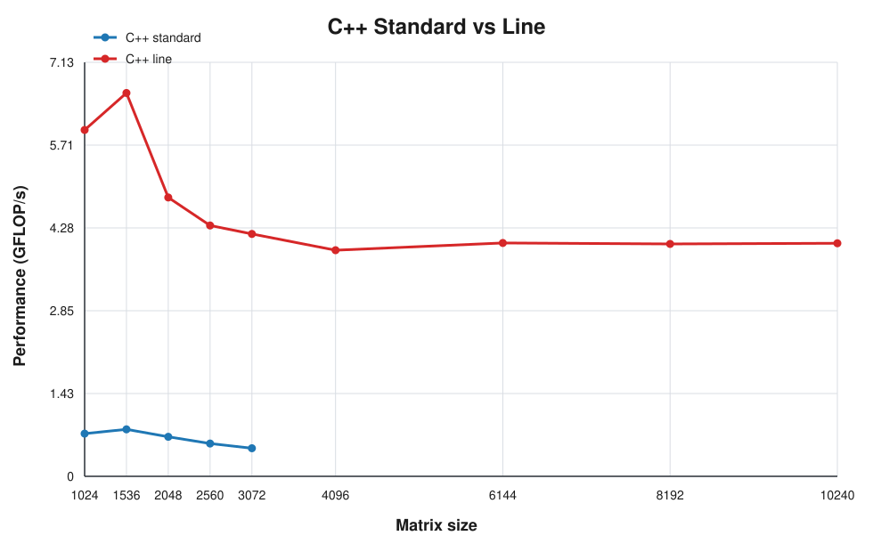

This is the clearest result in Part 1. For the shared sizes, `line` is around `7x` to `8.6x` faster than `standard` in C++.

For example:

- `1024`: `5.97` vs `0.74 GFLOP/s`
- `2048`: `4.80` vs `0.68 GFLOP/s`
- `3072`: `4.18` vs `0.48 GFLOP/s`

The arithmetic complexity is identical, so this difference comes almost entirely from memory behavior. The better traversal order allows the CPU to reuse cache lines more effectively and avoids the expensive column-wise walk over `B`.

### `line` vs `block`
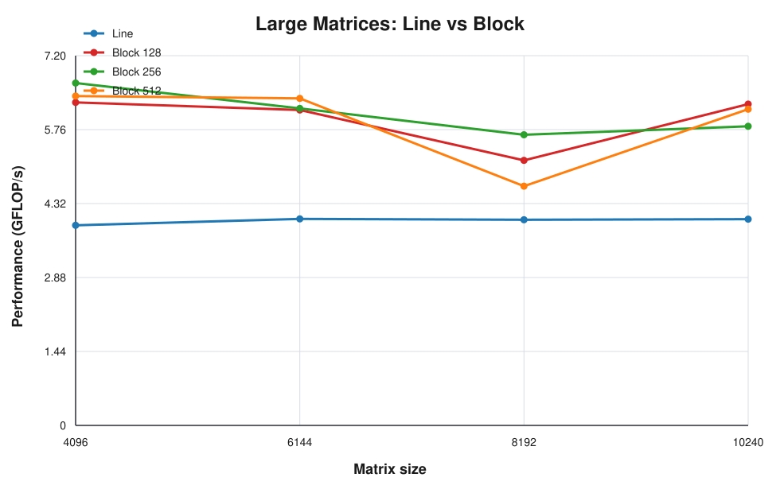
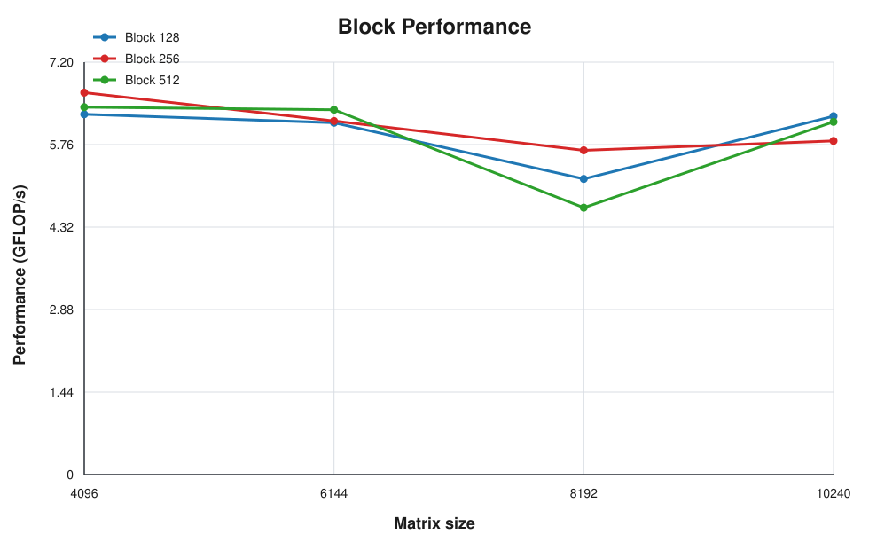

The blocked version provides the best performance for the large matrices. The direct comparison shows the main trend clearly: once the matrix size reaches `4096 x 4096`, the `line` version stays close to `4 GFLOP/s`, while the blocked versions move into the `5.66..6.66 GFLOP/s` range.

The best block size is not constant:

- `4096`: best result with block `256`
- `6144`: best result with block `512`
- `8192`: best result with block `256`
- `10240`: best result with block `128`

This suggests that the optimal block size depends on how well the blocks fit in the different cache levels.

### `perf` counters
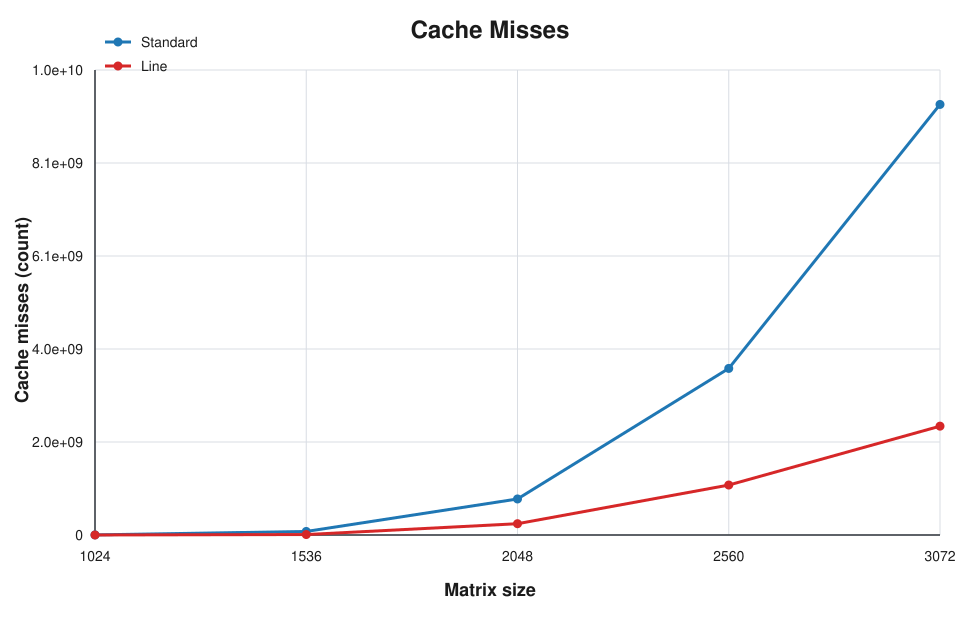
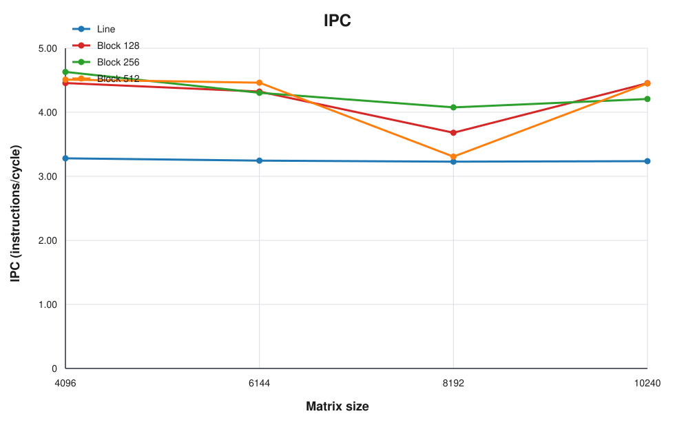

The `perf` counters support the timing results and provide an architectural explanation for the performance differences observed in the timing plots.

For the shared `standard` vs `line` sizes, `line` consistently reduces cache misses:

- `1024`: about `0.66M` misses for `line` vs `1.98M` for `standard`
- `1536`: about `9.95M` vs `77.12M`
- `3072`: about `2.37B` vs `9.36B`

This is exactly what the algorithmic discussion predicts: `line` keeps a friendlier access pattern for `B` and for `C`.

For the large matrices, the blocked version reduces misses by an even larger margin. At `10240`, the plain `line` version records about `131.66B` cache misses, while the lowest-miss blocked configuration stays below `1B`. The same trend appears at `4096`, `6144`, and `8192`, and it is consistent with the GFLOP/s improvement of the blocked version as a whole.

The IPC plot complements the cache-miss view. The blocked configurations maintain higher instruction-per-cycle values than the large `line` run, which is consistent with better locality and fewer memory-related stalls.

## Conclusions
Part 1 shows that memory hierarchy dominates the observed performance.

The first strong conclusion is that changing the loop order from `i-j-k` to `i-k-j` is enough to produce a dramatic speedup. In C++, the `line` algorithm is roughly one order of magnitude faster than `standard` while doing the same mathematical work.

The second conclusion is that blocking gives another clear improvement for large matrices. Once the working set grows well beyond cache, the blocked version preserves locality much better and reaches the highest throughput in the whole study.

The third conclusion is that C++ generally outperforms Java in the optimized cases, especially in the `line` implementation and in larger inputs, but the biggest factor is not the language itself. The main factor is the algorithmic organization of memory accesses.

Finally, the `perf` data is consistent with the timing results: the faster implementations are precisely the ones that reduce cache misses and use the memory hierarchy more effectively.


# Part 2

## Introduction
Part 2 extends the study from a single-core implementation to OpenMP-based multi-core versions of the same matrix multiplication kernels. The main objective is to evaluate how parallelization strategy affects performance, speedup, and efficiency, and to compare the behavior of the standard and line-oriented versions under different OpenMP directives.

This part is divided into two sections. The first studies fixed 4-thread behavior on matrices from `1024` to `3072`. The second studies only Version 2 on a fixed `8192 x 8192` matrix while increasing the thread count.

## What the assignment asks
The assignment requires:

1. Parallel versions of the first and second implementations of matrix multiplication.
2. Analysis of the two OpenMP solutions given for Version 1.
3. For Version 2, additional exploration of:
   - `#pragma omp for simd`
   - `#pragma omp parallel for collapse(2)`
4. Measurement of:
   - GFLOP/s
   - speedup
   - efficiency

For Section 1, the comparison uses 4 threads and matrix sizes `1024..3072`. For Section 2, the comparison uses only Version 2 on `8192 x 8192` with `4, 8, 12, 16, 20, 24` threads.

## Implementation Overview
The OpenMP code is implemented in [mult_omp.cpp](src/mult_omp.cpp). It includes five variants:

- `parallel1`: Version 1 with `#pragma omp parallel for` on the outer loop over `i`
- `parallel2`: Version 1 with a parallel region and `#pragma omp for` only on the inner loop over `k`
- `lineParallel1`: Version 2 with `#pragma omp parallel for` on the outer loop over `i`
- `lineSimd`: Version 2 with `#pragma omp for simd` on the inner loop over `j`
- `lineCollapse`: Version 2 with `#pragma omp parallel for collapse(2)` on loops `i` and `k`, using `atomic` on the update of `C[i][j]`

The sequential baselines used to compute speedup and efficiency were taken from the final Part 1 C++ results:

- `cpp,standard` for Version 1
- `cpp,line` for Version 2

## Algorithms and OpenMP Variants
### Version 1
The first version follows the classic `i-j-k` order:

```text
for i
    for j
        temp = 0
        for k
            temp += A[i][k] * B[k][j]
        C[i][j] = temp
```

Two OpenMP strategies were tested for this version:

`parallel1` uses `#pragma omp parallel for` on the outer loop over `i`. This directive creates a team of threads and distributes the iterations of that loop among them. In practice, each thread computes a different set of rows of the result matrix, which is a natural and has low overhead (low coordination between threads) because those rows are independent.

`parallel2` opens a `#pragma omp parallel` and then uses `#pragma omp for` only on the inner loop over `k`. In OpenMP, `parallel` only creates the thread team, while `for` decides how a specific loop is distributed. In this case, the work is split too deep inside the computation, which makes the decomposition much less convenient and explains why this version is expected to perform more poorly.

### Version 2
The second version reorders the loops to `i-k-j`:

```text
for i
    for k
        for j
            C[i][j] += A[i][k] * B[k][j]
```

This version is already more cache-friendly in the sequential case, so we analyze how different OpenMP directives interact with it in parallel execution.

`lineParallel1` is the baseline parallel version and uses `#pragma omp parallel for` on the outer loop over `i`. As in `parallel1`, the directive distributes independent rows across threads, which keeps the implementation simple and usually gives the best balance between parallel work and synchronization cost.

`lineSimd` uses `#pragma omp simd` on the inner loop over `j`, combined with `#pragma omp parallel for` on the outer loop over `i`. The goal is to preserve the outer-loop work distribution while encouraging SIMD vectorization inside each thread.

`lineCollapse` uses `#pragma omp parallel for collapse(2)` on the loops over `i` and `k`. The `collapse(2)` clause merges those two nested loops into one larger iteration space before distributing work across threads. This increases the amount of visible parallel work, but it also introduces a problem: different collapsed iterations may update the same `C[i][j]`. For that reason the implementation uses `#pragma omp atomic`, which forces each update to shared memory to be performed atomically and avoids races at the cost of extra synchronization.

## Results and Analysis
### Section 1 - Version 1
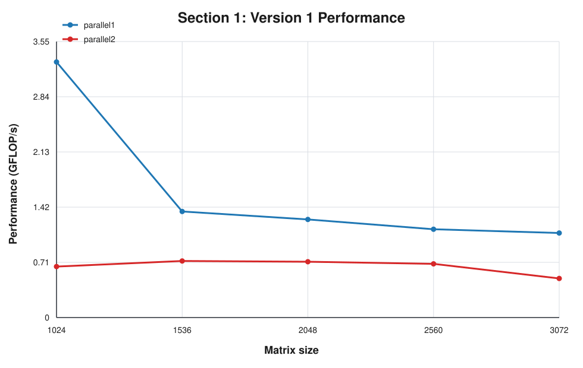
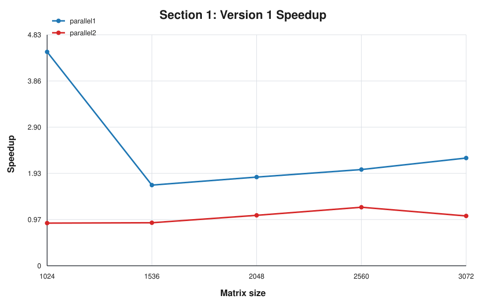

`parallel1` remains the better Version 1 implementation overall. It reaches higher GFLOP/s in most tested sizes, while `parallel2` stays competitive in part of the range.

This still matches what we would expect from this type of parallelization. Parallelizing the outer loop over `i` distributes independent rows of the result matrix, while the `parallel2` structure keeps the parallel work in the inner loop and results in a weaker decomposition of the computation.

### Section 1 - Version 2

`lineParallel1` is the strongest Version 2 result in this fixed 4-thread comparison, reaching `10.43 GFLOP/s` at `1024` and remaining near `8.5 GFLOP/s` at `3072`.

Efficiency follows the same pattern, with `lineParallel1` consistently making better use of the available threads across all matrix sizes.

### Section 2 - Version 2 (`8192 x 8192`)
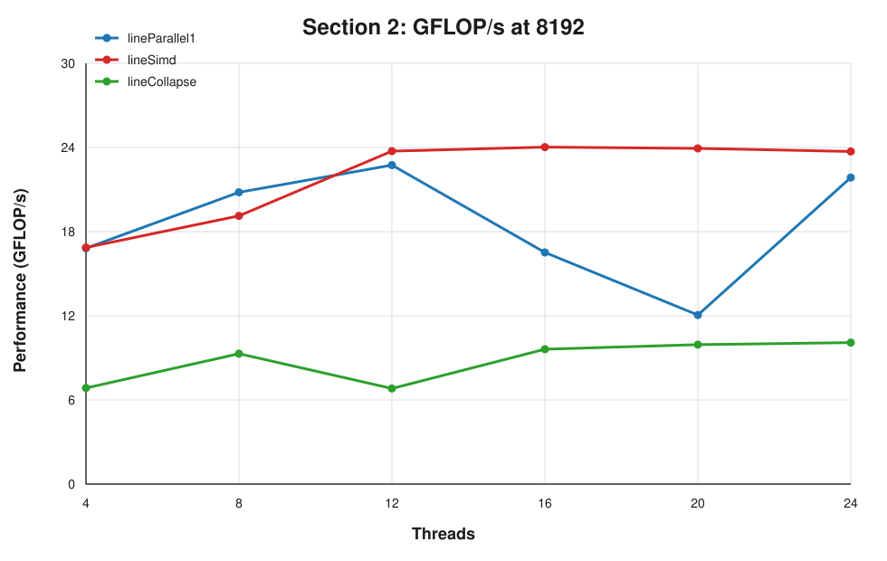
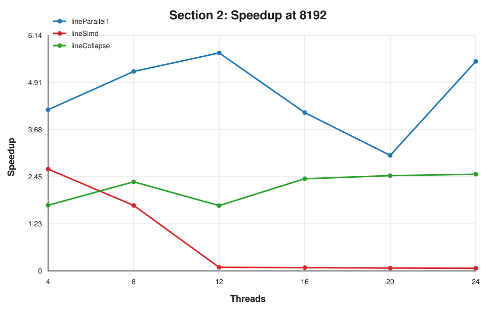

The most important conclusion from Section 2 is that `lineSimd` becomes the strongest strategy as the thread count increases. It starts close to `lineParallel1` at 4 threads and then moves ahead, reaching about `24.03 GFLOP/s` at 16 threads.

`lineParallel1` remains competitive, especially up to 12 threads, but `lineCollapse` stays clearly below the other two variants. Its speedup is modest, roughly between `1.7` and `2.5`, which is consistent with the overhead introduced by combining loop collapsing with atomic updates.

This suggests that SIMD on the innermost loop can improve the Version 2 when combined with the outer-loop OpenMP decomposition.

## Conclusions
Part 2 confirms that simply adding OpenMP is not enough to guarantee good parallel performance. The decomposition strategy matters as much as the number of threads.

For Version 1, `parallel1` is still superior to `parallel2`, although `parallel2` remains competitive in part of the tested range.

For Version 2, `lineParallel1` is the strongest option in the 4 thread comparison, while `lineSimd` gives the best results in the `8192 x 8192` range.

`lineCollapse` is functional but limited, mainly because atomic introduces extra synchronization overhead.

Overall, the best results are obtained when a good memory layout is combined with a simple, low-overhead parallel structure, and in the larger thread count SIMD is the best implementation.
