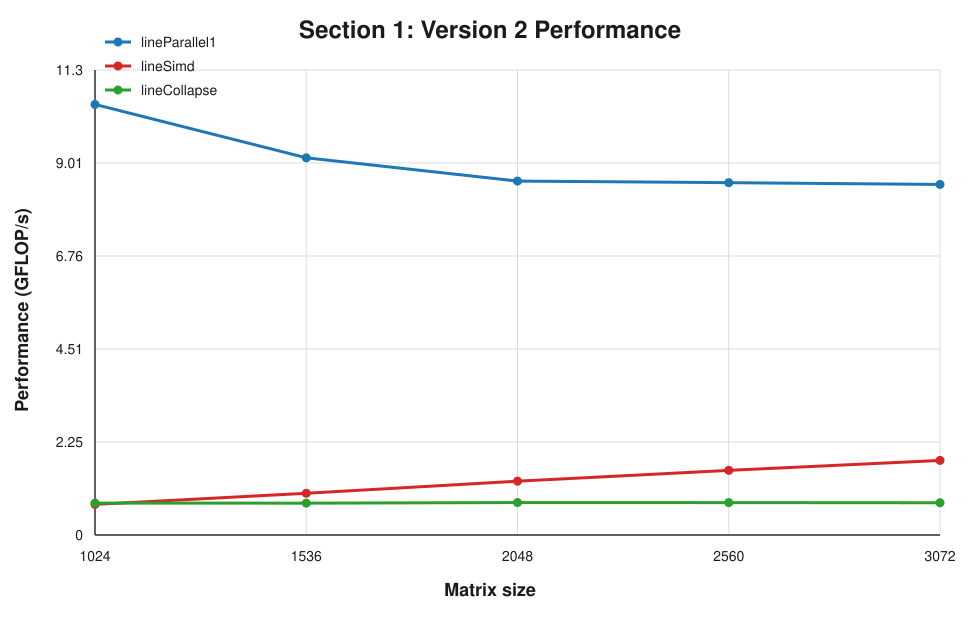
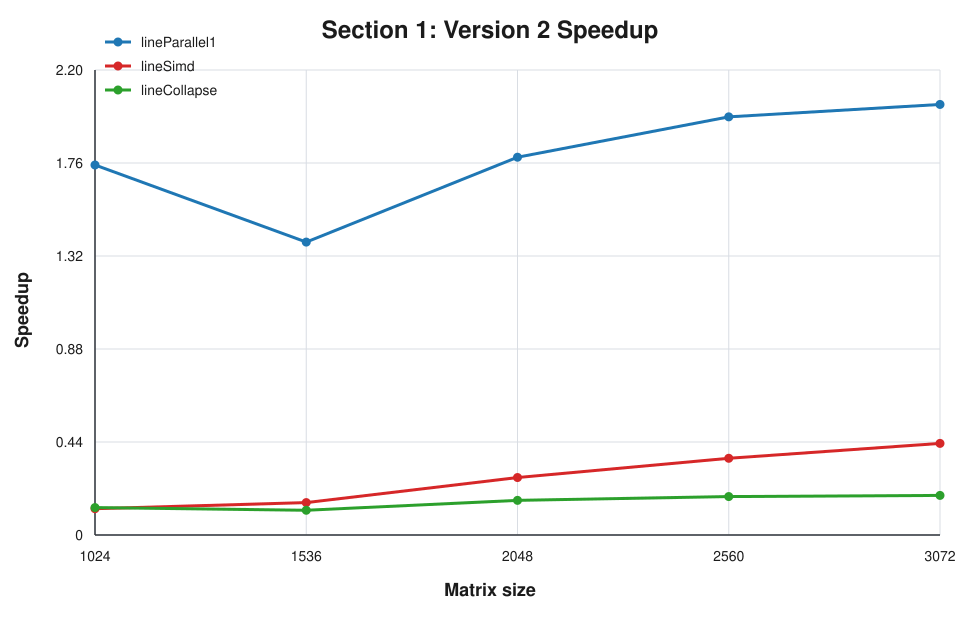

# CPD Project 1, Part 2

## Introduction
Part 2 extends the study from a single-core implementation to OpenMP-based multi-core versions of the same matrix multiplication kernels. The main objective is to evaluate how parallelization strategy affects performance, speedup, and efficiency, and to compare the behavior of the standard and line-oriented versions under different OpenMP directives.

This part is divided into two sections. The first studies fixed 4-thread behavior on matrices from `1024` to `3072`. The second studies only Version 2 on a fixed `8192 x 8192` matrix while increasing the thread count.

## What the assignment asks
The assignment requires:

1. Parallel versions of the first and second implementations of matrix multiplication.
2. Analysis of the two OpenMP solutions given for Version 1.
3. For Version 2, additional exploration of:
   - `#pragma omp for simd`
   - `#pragma omp parallel for collapse(2)`
4. Measurement of:
   - GFLOP/s
   - speedup
   - efficiency

For Section 1, the comparison uses 4 threads and matrix sizes `1024..3072`. For Section 2, the comparison uses only Version 2 on `8192 x 8192` with `4, 8, 12, 16, 20, 24` threads.

## Implementation Overview
The OpenMP code is implemented in [mult_omp.cpp](../src/mult_omp.cpp). It includes five variants:

- `parallel1`: Version 1 with `#pragma omp parallel for` on the outer loop over `i`
- `parallel2`: Version 1 with a parallel region and `#pragma omp for` only on the inner loop over `k`
- `lineParallel1`: Version 2 with `#pragma omp parallel for` on the outer loop over `i`
- `lineSimd`: Version 2 with `#pragma omp for simd` on the inner loop over `j`
- `lineCollapse`: Version 2 with `#pragma omp parallel for collapse(2)` on loops `i` and `k`, using `atomic` on the update of `C[i][j]`

The sequential baselines used to compute speedup and efficiency were taken from the final Part 1 C++ results:

- `cpp,standard` for Version 1
- `cpp,line` for Version 2

## Algorithms and OpenMP Variants
### Version 1
The first version follows the classic `i-j-k` order:

```text
for i
    for j
        temp = 0
        for k
            temp += A[i][k] * B[k][j]
        C[i][j] = temp
```

Two OpenMP strategies were tested for this version:

`parallel1` uses `#pragma omp parallel for` on the outer loop over `i`. This directive creates a team of threads and distributes the iterations of that loop among them. In practice, each thread computes a different set of rows of the result matrix, which is a natural and has low overhead (low coordination between threads) because those rows are independent.

`parallel2` opens a `#pragma omp parallel` and then uses `#pragma omp for` only on the inner loop over `k`. In OpenMP, `parallel` only creates the thread team, while `for` decides how a specific loop is distributed. In this case, the work is split too deep inside the computation, which makes the decomposition much less convenient and explains why this version is expected to perform more poorly.

### Version 2
The second version reorders the loops to `i-k-j`:

```text
for i
    for k
        for j
            C[i][j] += A[i][k] * B[k][j]
```

This version is already more cache-friendly in the sequential case, so we analyze how different OpenMP directives interact with it in parallel execution.

`lineParallel1` is the baseline parallel version and uses `#pragma omp parallel for` on the outer loop over `i`. As in `parallel1`, the directive distributes independent rows across threads, which keeps the implementation simple and usually gives the best balance between parallel work and synchronization cost.

`lineSimd` uses `#pragma omp for simd` on the inner loop over `j`, inside a parallel region. The `for simd` directive attempts to combine two ideas at once: 
1. Distribute loop iterations among the existing threads
2. Encourage SIMD vectorization inside each thread. 

In principle, this can improve arithmetic throughput, but its success depends heavily on the loop structure, compiler behavior, and runtime overhead.

`lineCollapse` uses `#pragma omp parallel for collapse(2)` on the loops over `i` and `k`. The `collapse(2)` clause merges those two nested loops into one larger iteration space before distributing work across threads. This increases the amount of visible parallel work, but it also introduces a problem: different collapsed iterations may update the same `C[i][j]`. For that reason the implementation uses `#pragma omp atomic`, which forces each update to shared memory to be performed atomically and avoids races at the cost of extra synchronization.

## Results and Analysis
### Section 1 - Version 1


`parallel1` is clearly the better Version 1 implementation. It reaches higher GFLOP/s at every tested size and shows speedup between about `1.69` and `4.47`, depending on matrix size. `parallel2`, by contrast, remains close to speedup `1` and sometimes below for smaller matrix cases.

This matches what we would expect from this type of parallelization. Parallelizing the outer loop over `i` distributes independent rows of the result matrix, while the `parallel2` structure keeps the parallel work in the inner loop which results in a much weaker decomposition of the computation.

### Section 1 - Version 2



`lineParallel1` is the strongest variant of Version 2 across all matrix sizes. It is also the best-performing implementation in the whole dataset, reaching `10.43 GFLOP/s` at `1024` and remaining near `8.5 GFLOP/s` at `3072`.

`lineSimd` and `lineCollapse` perform significantly worse. In this environment, `lineSimd` never approaches the plain `lineParallel1` version, and `lineCollapse` is consistently limited by the synchronization cost of the `atomic` updates. 

Efficiency follows the same pattern, with `lineParallel1` consistently making better use of the available threads across all matrix sizes.

### Section 2 - Version 2 (`8192 x 8192`)


The most important conclusion from Section 2 is  `lineParallel1` remains the best strategy as the thread count increases. Its measured GFLOP/s grows from about `16.82` at 4 threads to `22.74` at 12 threads, and it still maintains good performance at 24 threads, although the gains are no longer linear.

`lineCollapse` stays clearly below `lineParallel1`. Its speedup is modest, roughly between `1.7` and `2.5`, which is consistent with the overhead introduced by combining loop collapsing with atomic updates.

`lineSimd` is the weakest variant. Its performance drops as the thread count increases, and the measured value at 12 threads already goes down to about `0.38 GFLOP/s`, with speedup close to zero. This suggests that, in this implementation and experimental setup, the OpenMP for simd strategy does not interact well with the loop organization.

## Conclusions
Part 2 confirms that simply adding OpenMP is not enough to guarantee good parallel performance. The decomposition strategy matters as much as the number of threads.

For Version 1, `parallel1` is  superior to `parallel2` approach. This shows that the parallelism across independent rows is much more effective than trying to distribute only the inner loop.

For Version 2, `lineParallel1` is the best overall solution. It combines the good memory access pattern of `i-k-j` with a clean outer loop parallelization and consistently delivers the highest GFLOP/s and the strongest speedup.

`lineCollapse` is functional but limited, mainly because atomic introduces extra synchronization overhead. `lineSimd` performs poorly in this dataset and becomes the worst performing option as the thread count grows.

Overall, the best results are obtained when a good memory layout is combined with a simple, low-overhead parallel structure. In this project, that combination is `lineParallel1`.
